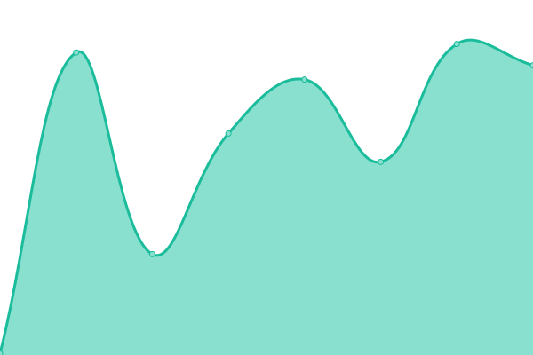

# Novara Status

Uptime monitor and status page for Novara services, powered by [Upptime](https://upptime.js.org).

## Services Monitored

- **Production API** — `api.novarafertility.com`
- **Staging API** — `staging-api.novarafertility.com`
- **Frontend** — `novarafertility.com` (Vercel)

<!--start: status pages-->
<!-- This summary is generated by Upptime (https://github.com/upptime/upptime) -->
<!-- Do not edit this manually, your changes will be overwritten -->
<!-- prettier-ignore -->
| URL | Status | History | Response Time | Uptime |
| --- | ------ | ------- | ------------- | ------ |
|  [Production API](https://api.novarafertility.com/api/health-check) | 🟩 Up | [production-api.yml](https://github.com/ellingtonsp/novara-status/commits/HEAD/history/production-api.yml) | 

 210ms
     
 | 

<a href="https://status.novarafertility.com/history/production-api">100.00%</a>
    

|  [Staging API](https://staging-api.novarafertility.com/api/health-check) | 🟩 Up | [staging-api.yml](https://github.com/ellingtonsp/novara-status/commits/HEAD/history/staging-api.yml) | 

 173ms
     
 | 

<a href="https://status.novarafertility.com/history/staging-api">100.00%</a>
    

|  [Frontend (Vercel)](https://novarafertility.com) | 🟩 Up | [frontend-vercel.yml](https://github.com/ellingtonsp/novara-status/commits/HEAD/history/frontend-vercel.yml) | 

 132ms
     
 | 

<a href="https://status.novarafertility.com/history/frontend-vercel">100.00%</a>
    

<!--end: status pages-->
